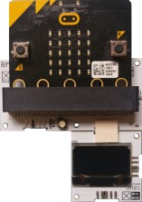

# XinaBox OD01 MakeCode extension

The OD01 is 64x128 dot matrix monochrome OLED screen which has an SSD1306 mounted on to it. Use it with a micro:bit to expand your output options:
 


This library provides functions to print and draw to the OD01 OLED display. 

The following functions are provided (with examples later):
* initialise OLED. This is triggered by default and you don't need to use this normally.
* display ON / OFF.  It is ON by default

NB: you do NOT need to initialise or turn on the OLED before using it - both are done when the micro:bit powers up the circuit.
* print String. Write anything to screen, and specify whether the start the NEXT print on a new line.
* print number. Write a number to screen, and specify whether the start the NEXT print on a new line.
* clear screen. 
* invert screen TRUE / FALSE. Setting this to TRUE causes all pixels to change from on to off, or off to on.

These are your main printing tools, but you can also use these functions to put text and numbers on screen:
* show string
* show number

The 2 functions allow you to specify the location where the text / number is printed. 
In addition, you can use a Color parameter to write the text / number differently

There are also several functions that allow you to draw items on to the screen at a location you specify:
* set pixel
* draw horizontal line
* draw vertical line
* draw rectangle
In each case you also specify a Color (soz UK for spelling). Color = 1 means the image is drawn and Color = 0 means the image is erased. 

This extension is based on [the OLED Package from microbit/micropython Chinese community](https://github.com/makecode-extensions/OLED12864_I2C). Great thanks to Shaoziyang for all the heavy lifting.
 

## How-to guides

A comprehensive set of How-to guides that show you how to use the blocks and provides simple examples of the code is available online:
[XinaBox How-to Guides for OD01 on BBC micro:bit using MakeCode](https://drive.google.com/open?id=1_LvtXnSPReET5C7jfOD7VrZdRPcyU_uF)


## Basic Printing: Print string / number on same line / new line:

```blocks
// Print "Number = " then "42" on the NEXT line:
OD01.printString("Number = ", true)
OD01.printNumber(42, true)

// Print "Number = " then "42" on the SAME line:
OD01.printString("Number = ", false)
OD01.printNumber(42, true)

```

```blocks

// And of course, when you want to start again just use clear screen:
OD01.clear()

```

```blocks

// Or even go for a strobe effect with the screen invert function (Warning - flashing light):
basic.forever(function () {
    OD01.invert(true)
    basic.pause(200)
    OD01.invert(false)
    basic.pause(200)
})

```

## Basic Drawing: Flashing a string / number:

```blocks
// Print "Number = " then "42" in the location specified (column = 42, row = 4, color = 1):
OD01.String("Calling", 42, 4, 1)
OD01.Number(446, 88, 4, 1)

// Print "Calling " then "446" in the same place but inverted (use for emphasis like bold):
OD01.String("Calling", 42, 4, 0)
OD01.Number(446, 88, 4, 0)

```

You would use showString / showString instead of printString / printString when you have a fixed screen layout, such as in a game.
With the print functions it is hard to control where text or numbers are shown on screen.
The Show functions allow you specify exactly where something is shown.
If you wanted to show the score of a game in the top right of the screen you would use showNumber

```blocks

// Now put these together to create a cool flashing effect:
basic.forever(function () {
    OD01.String("Calling", 42, 4, 1)
    OD01.Number(446, 88, 4, 1)
    basic.pause(500)
    OD01.String("Calling", 42, 4, 0)
    OD01.Number(446, 88, 4, 0)
    basic.pause(500)
})

```

There are loads of other drawing functions. Check out our How-to Guides online to learn how to use them all, and in the process learn how to make a pixel bounce around the screen and how to control a rectangle with the A and B buttons.


## License

MIT

Copyright (c) 2019, XinaBox  

## Supported targets

* for PXT/microbit

